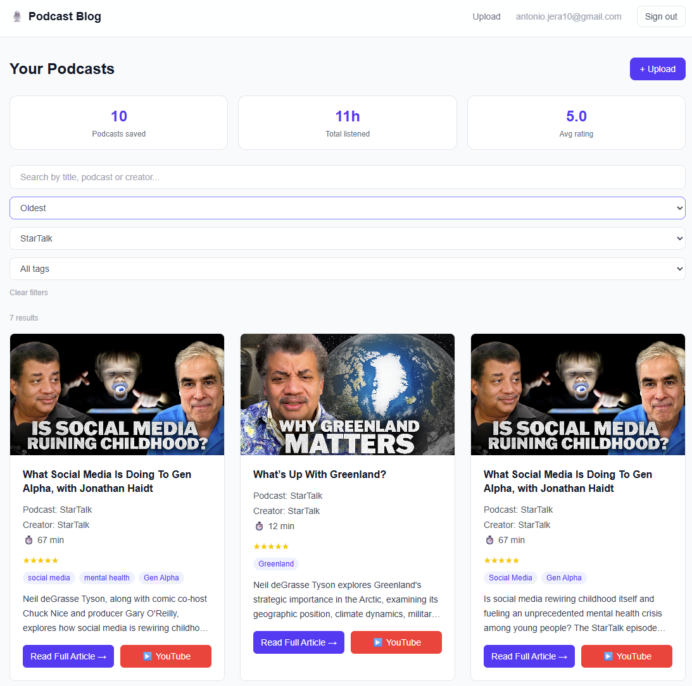
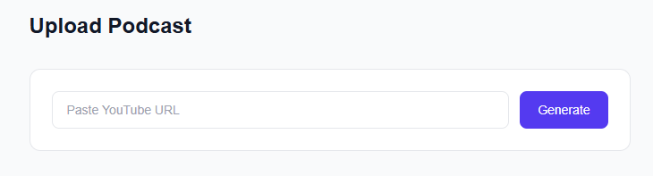
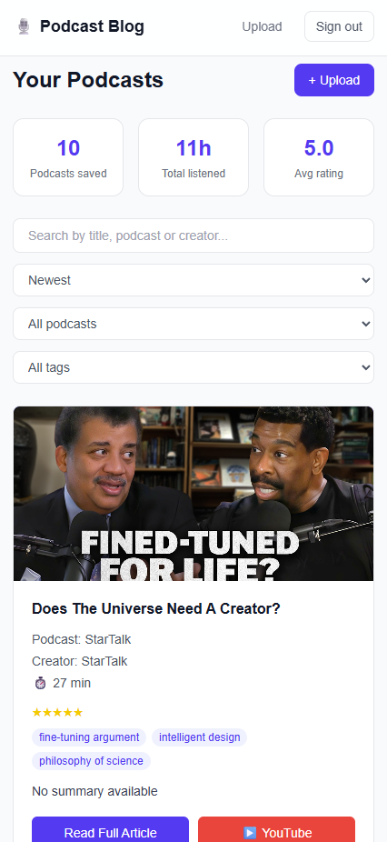

<div align="center">

# Podcast Blog


**AI-powered podcast summarization platform — paste a YouTube link, get a detailed written article with key takeaways, quotes, and actionable advice.**

<!-- Replace # with your deployed URL -->
[Live Demo](https://podcast-blog-v2.vercel.app)

---


</div>

---

## Features

- **AI-Powered Summarization** — Automatically generates structured articles from YouTube podcast episodes using Perplexity AI
- **Rich Content Generation** — Produces section breakdowns, notable quotes, key takeaways, and actionable advice
- **Search & Filter** — Find podcasts by title, creator, or podcast name with tag-based filtering
- **Sort Options** — Sort by newest, oldest, highest rated, longest, or shortest
- **Star Ratings** — Rate podcast episodes from 1 to 5 stars
- **YouTube Integration** — Extracts metadata and thumbnails directly from YouTube URLs
- **Authentication** — Secure login with email/password or GitHub OAuth via Supabase
- **Progressive Web App** — Installable on any device with offline support
- **Fully Responsive** — Optimized for desktop, tablet, and mobile

---

## Tech Stack

| Layer | Technology |
|-------|-----------|
| Framework | [Next.js 16](https://nextjs.org/) (App Router) |
| Language | [TypeScript 5](https://www.typescriptlang.org/) |
| Styling | [Tailwind CSS 4](https://tailwindcss.com/) |
| Database & Auth | [Supabase](https://supabase.com/) (PostgreSQL) |
| AI Engine | [Perplexity AI](https://www.perplexity.ai/) (sonar-reasoning-pro) |
| PWA | [next-pwa](https://github.com/DuCanhGH/next-pwa) |

---

## Screenshots

<div align="center">

### Homepage



### Upload & Generate



### Podcast Detail


### Mobile View



</div>

---

## Getting Started

### Prerequisites

- **Node.js** 18+
- **npm**
- A [Supabase](https://supabase.com/) account and project
- A [Perplexity AI](https://www.perplexity.ai/) API key

### Installation

1. **Clone the repository**

   ```bash
   git clone https://github.com/kizza00232jera/podcast-blog.git
   cd podcast-blog
   ```

2. **Install dependencies**

   ```bash
   npm install
   ```

3. **Set up environment variables**

   Create a `.env.local` file in the project root:

   ```env
   NEXT_PUBLIC_SUPABASE_URL=your-supabase-project-url
   NEXT_PUBLIC_SUPABASE_ANON_KEY=your-supabase-anon-key
   PERPLEXITY_API_KEY=your-perplexity-api-key
   ```

4. **Set up the database**

   In your Supabase project, create a `podcast_posts` table with the following schema:

   ```sql
   create table podcast_posts (
     id uuid default gen_random_uuid() primary key,
     slug text unique not null,
     title text not null,
     podcast_name text,
     creator text,
     source_link text,
     thumbnail_url text,
     duration_minutes integer,
     rating integer,
     tags text[],
     summary jsonb,
     key_takeaways text,
     actionable_advice text,
     resources text,
     user_id uuid references auth.users(id),
     created_at timestamptz default now()
   );
   ```

5. **Run the development server**

   ```bash
   npm run dev
   ```

   Open [http://localhost:3000](http://localhost:3000) in your browser.

---

## Project Structure

```
app/
├── (auth)/                    # Authentication pages (login, signup)
├── (main)/                    # Protected pages (requires auth)
│   ├── page.tsx               # Homepage — podcast grid + stats
│   ├── upload/page.tsx        # Upload — YouTube URL → AI generation
│   └── podcast/[slug]/        # Dynamic podcast detail pages
├── api/
│   ├── generate/route.ts      # AI content generation endpoint
│   └── auth/callback/route.ts # OAuth callback handler
├── components/
│   ├── ui/                    # Shared UI components (Header)
│   └── podcast/               # Podcast-specific components
├── lib/supabase/              # Supabase client utilities
├── types/                     # TypeScript type definitions
├── layout.tsx                 # Root layout
└── globals.css                # Global styles
```

---

## Environment Variables

| Variable | Description | Where to Get It |
|----------|-------------|-----------------|
| `NEXT_PUBLIC_SUPABASE_URL` | Your Supabase project URL | [Supabase Dashboard](https://app.supabase.com/) → Settings → API |
| `NEXT_PUBLIC_SUPABASE_ANON_KEY` | Supabase anonymous/public key | [Supabase Dashboard](https://app.supabase.com/) → Settings → API |
| `PERPLEXITY_API_KEY` | Perplexity AI API key | [Perplexity Settings](https://www.perplexity.ai/settings/api) |

---

## API Integrations

### Perplexity AI
Powers the core content generation. When a user submits a YouTube URL, the `/api/generate` endpoint sends a structured prompt to the `sonar-reasoning-pro` model, which returns a detailed JSON article with sections, quotes, takeaways, and metadata.

### YouTube oEmbed
Extracts video metadata (title, author) from YouTube URLs before sending to the AI model, providing additional context for better generation results.

### Supabase
Handles user authentication (email/password + GitHub OAuth) and stores all podcast data in a PostgreSQL database with Row Level Security.

---

## Deployment

The easiest way to deploy is with [Vercel](https://vercel.com/):

1. Push your code to GitHub
2. Import the repository on [Vercel](https://vercel.com/new)
3. Add your environment variables in the Vercel dashboard
4. Deploy

Make sure to add your Vercel deployment URL to your Supabase project's allowed redirect URLs under **Authentication → URL Configuration**.

---

<div align="center">

**Built with Next.js, Supabase, and Perplexity AI**

</div>
