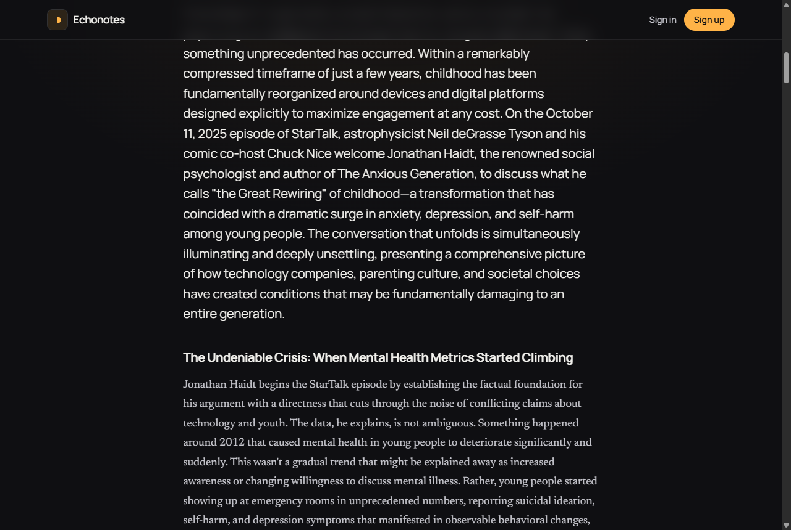

<h1 align="center">Echonotes</h1>

<p align="center">
  <b>Paste a YouTube podcast link. Get a rich, readable written summary, in the podcast's own language.</b>
</p>

<p align="center">
  
  
  
  
  
  
  
</p>

<p align="center">
  <a href="https://podcast-blog-v2.vercel.app">Live app</a> · <a href="#how-it-works">How it works</a> · <a href="#getting-started">Getting started</a> · <a href="#tech-stack">Tech stack</a>
</p>

<p align="center">
  
</p>

## What it is

Every week I watch podcasts across tech, football, and business, and a week later I can barely recall the key points. Echonotes fixes that. You paste a YouTube podcast link, and Claude reads the episode's real captions and writes a structured article you can scan in five minutes: a one line lede, several themed sections that follow the episode's actual arc, one woven verbatim quote per topic, and a short list of key takeaways.

The work runs in the background on hosted infrastructure, so it finishes even with your computer switched off. Anonymous visitors get a read only public showcase; signed in users get their own private library.

## Features

- **Summaries by Claude Opus 4.8** ([`app/lib/summarize.ts`](app/lib/summarize.ts)): a calibrated prompt produces deep, magazine quality summaries (1,500 to 2,200 words, dynamic sections, woven quotes, key takeaways) using structured output, not thin recaps.
- **Original language output**: a Croatian podcast gets a Croatian summary, a Spanish one gets Spanish. The model writes in the transcript's own language.
- **Real transcripts, captions first** ([`app/lib/transcript`](app/lib/transcript)): a multi provider layer (Supadata, then TranscriptAPI) fetches existing YouTube captions, with per provider monthly budget guards so a free tier can never be drained or locked out.
- **Background generation** ([`app/api/worker/route.ts`](app/api/worker/route.ts)): clicking Generate inserts a placeholder and hands the heavy work to a QStash queue, then the card fills itself in with a live, stage based progress bar (queued, fetching transcript, writing summary).
- **Auth and a public showcase** ([`middleware.ts`](middleware.ts)): Clerk handles sign in (Google, GitHub, email). Anonymous visitors browse the showcase; registering gives you a private library.
- **Rate limited** ([`app/lib/ratelimit.ts`](app/lib/ratelimit.ts)): Upstash limits generations per user per day to keep costs predictable.
- **Installable PWA**: warm dark audio identity, an opening splash, installable on any device.

## Screenshots

<table>
  <tr>
    <td align="center"><b>Reading view</b></td>
    <td align="center"><b>Mobile</b></td>
  </tr>
  <tr>
    <td></td>
    <td></td>
  </tr>
</table>

## How it works

```
Paste URL ─▶ /api/generate ─▶ insert "generating" row ─▶ QStash queue
                                                              │
                                                              ▼
                                   /api/worker (signature verified)
                                   1. fetch captions (Supadata ▸ TranscriptAPI)
                                   2. summarize with Claude Opus 4.8 (structured output)
                                   3. save ─▶ card flips to the finished summary
```

The request returns immediately, so there are no timeouts and retries are automatic. Captions only by design: videos with no captions report a clear message rather than running expensive audio transcription.

## Tech stack

| Layer | Choice |
|---|---|
| Framework | Next.js 16 (App Router), React 19, TypeScript |
| AI | Claude Opus 4.8 via the Anthropic SDK (structured output, adaptive thinking) |
| Transcripts | Supadata + TranscriptAPI (captions only, budget guarded) |
| Database | Neon Postgres + Drizzle ORM |
| Auth | Clerk |
| Background jobs | Upstash QStash |
| Rate limiting | Upstash Redis |
| Styling | Tailwind CSS 4 |
| Hosting | Vercel |

## Getting started

### Prerequisites

- Node.js 20+
- Accounts/keys for: [Anthropic](https://console.anthropic.com), [Neon](https://neon.tech), [Clerk](https://clerk.com), [Upstash](https://upstash.com) (Redis + QStash), and a transcript provider ([Supadata](https://supadata.ai), optional [TranscriptAPI](https://transcriptapi.com))

### Installation

```bash
git clone https://github.com/Kizza00232Jera/podcast-blog-v2.git
cd podcast-blog-v2
npm install
```

### Environment

Copy your keys into `.env.local` (gitignored):

```bash
ANTHROPIC_API_KEY=
DATABASE_URL=                 # Neon pooled connection (app runtime)
DATABASE_URL_UNPOOLED=        # Neon direct connection (Drizzle migrations)
NEXT_PUBLIC_CLERK_PUBLISHABLE_KEY=
CLERK_SECRET_KEY=
UPSTASH_REDIS_REST_URL=
UPSTASH_REDIS_REST_TOKEN=
QSTASH_URL=https://qstash-eu-central-1.upstash.io
QSTASH_TOKEN=
QSTASH_CURRENT_SIGNING_KEY=
QSTASH_NEXT_SIGNING_KEY=
SUPADATA_API_KEY=             # transcript provider
TRANSCRIPTAPI_API_KEY=        # optional fallback
NEXT_PUBLIC_APP_URL=http://localhost:3000
```

### Database and run

```bash
npm run db:push   # create the schema in Neon
npm run dev       # http://localhost:3000
```

> Background generation calls back to `NEXT_PUBLIC_APP_URL/api/worker` via QStash, which needs a publicly reachable URL, so the Generate flow completes in a deployed environment rather than on localhost.

## Project structure

```
app/
  (main)/                 home (showcase / library), upload, podcast/[slug] article
  api/generate/route.ts   enqueue a generation
  api/worker/route.ts     QStash worker: captions -> Claude -> save
  lib/transcript/         multi-provider captions layer (budget guarded)
  lib/summarize.ts        calibrated Opus 4.8 prompt + structured output
  lib/db/                 Drizzle schema, client, queries
  components/             gallery cards, progress bar, splash, header
middleware.ts             Clerk auth + public showcase
```

## Deployment

Deployed on Vercel. Push the environment variables to the project, set `NEXT_PUBLIC_APP_URL` to the production URL (so QStash callbacks resolve), and deploy. The repo is Git connected, so pushes to `master` redeploy automatically.

## License

[MIT](LICENSE) © Antonio Jerković
