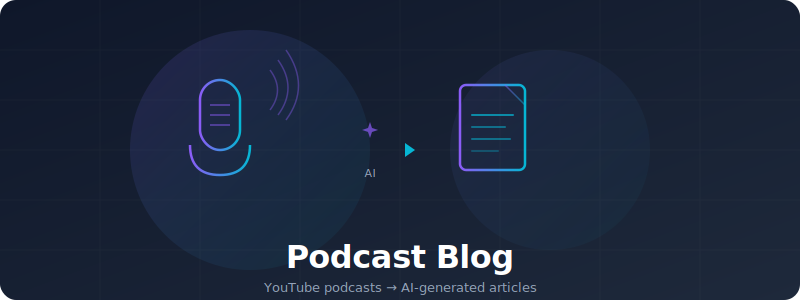

<p align="center">
  
</p>

<p align="center">
  
  
  
  
  
</p>

<p align="center">
  <a href="https://podcast-blog-v2.vercel.app">Live Demo</a> · <a href="#getting-started">Getting Started</a> · <a href="#features">Features</a> · <a href="#project-structure">Project Structure</a>
</p>

<p align="center">
  
</p>

## Podcast Blog is an AI-powered platform that turns YouTube podcasts into detailed written articles

Paste a YouTube podcast link and [Podcast Blog](https://podcast-blog-v2.vercel.app) automatically generates a comprehensive written article including:

- [**AI Summarization**](app/api/generate/route.ts): Generates structured articles from YouTube podcast episodes using Perplexity AI's `sonar-reasoning-pro` model with section breakdowns, notable quotes, key takeaways, and actionable advice.
- [**Smart Search & Filtering**](app/components/podcast/PodcastGrid.tsx): Search by title, creator, or podcast name. Filter by podcast or tags. Sort by newest, oldest, highest rated, longest, or shortest.
- [**Star Ratings**](app/components/podcast/PodcastCard.tsx): Rate podcast episodes from 1 to 5 stars to keep track of your favorites.
- [**YouTube Integration**](app/api/generate/route.ts): Automatically extracts metadata, thumbnails, and video information directly from YouTube URLs via oEmbed API.
- [**Authentication**](app/(auth)): Secure login with email/password or GitHub OAuth powered by Supabase Auth.
- [**Progressive Web App**](next.config.ts): Installable on any device with offline support via next-pwa.
- [**Responsive Design**](app/globals.css): Fully optimized for desktop, tablet, and mobile devices.

## Table of Contents

- [Podcast Blog is an AI-powered platform that turns YouTube podcasts into detailed written articles](#podcast-blog-is-an-ai-powered-platform-that-turns-youtube-podcasts-into-detailed-written-articles)
- [Table of Contents](#table-of-contents)
- [Screenshots](#screenshots)
- [Getting Started](#getting-started)
  - [Prerequisites](#prerequisites)
  - [Installation](#installation)
  - [Database Setup](#database-setup)
- [Setting Up Podcast Blog](#setting-up-podcast-blog)
- [Project Structure](#project-structure)
- [API Integrations](#api-integrations)
- [Deployment](#deployment)

## Screenshots

<table>
  <tr>
    <td align="center"><b>Homepage</b></td>
    <td align="center"><b>Podcast Detail</b></td>
  </tr>
  <tr>
    <td></td>
    <td></td>
  </tr>
  <tr>
    <td align="center"><b>Upload & Generate</b></td>
    <td align="center"><b>Mobile View</b></td>
  </tr>
  <tr>
    <td></td>
    <td></td>
  </tr>
</table>

## Getting Started

### Prerequisites

- [Node.js](https://nodejs.org/) 18 or higher
- A [Supabase](https://supabase.com/) account and project
- A [Perplexity AI](https://www.perplexity.ai/) API key

### Installation

```bash
git clone https://github.com/kizza00232jera/podcast-blog-v2.git
cd podcast-blog-v2
npm install
```

Create a `.env.local` file in the project root:

```env
NEXT_PUBLIC_SUPABASE_URL=your-supabase-project-url
NEXT_PUBLIC_SUPABASE_ANON_KEY=your-supabase-anon-key
PERPLEXITY_API_KEY=your-perplexity-api-key
```

| Variable | Description | Where to Get It |
|----------|-------------|-----------------|
| `NEXT_PUBLIC_SUPABASE_URL` | Your Supabase project URL | [Supabase Dashboard](https://app.supabase.com/) → Settings → API |
| `NEXT_PUBLIC_SUPABASE_ANON_KEY` | Supabase anonymous/public key | [Supabase Dashboard](https://app.supabase.com/) → Settings → API |
| `PERPLEXITY_API_KEY` | Perplexity AI API key | [Perplexity Settings](https://www.perplexity.ai/settings/api) |

### Database Setup

In your Supabase project, create the `podcast_posts` table:

```sql
create table podcast_posts (
  id uuid default gen_random_uuid() primary key,
  slug text unique not null,
  title text not null,
  podcast_name text,
  creator text,
  source_link text,
  thumbnail_url text,
  duration_minutes integer,
  rating integer,
  tags text[],
  summary jsonb,
  key_takeaways text,
  actionable_advice text,
  resources text,
  user_id uuid references auth.users(id),
  created_at timestamptz default now()
);
```

## Setting Up Podcast Blog

Once you've completed the installation and database setup, start the development server:

```bash
npm run dev
```

Open [http://localhost:3000](http://localhost:3000) in your browser. You can:

1. **Sign up** with email/password or GitHub OAuth
2. **Navigate to Upload** and paste any YouTube podcast URL
3. **Click Generate** — the AI will analyze the podcast and create a full written article
4. **Browse your library** on the homepage with search, filters, and sorting
5. **Rate episodes** and organize them by tags

## Project Structure

```
app/
├── (auth)/                        # Auth pages (login, signup)
│   ├── login/page.tsx             # Email + GitHub OAuth login
│   └── signup/page.tsx            # User registration
├── (main)/                        # Protected routes (requires auth)
│   ├── page.tsx                   # Homepage — podcast grid + stats dashboard
│   ├── upload/page.tsx            # YouTube URL input → AI generation
│   └── podcast/[slug]/page.tsx    # Full podcast article view
├── api/
│   ├── generate/route.ts          # POST endpoint — Perplexity AI integration
│   └── auth/callback/route.ts     # OAuth callback handler
├── components/
│   ├── ui/Header.tsx              # Navigation bar with sign out
│   └── podcast/
│       ├── PodcastGrid.tsx        # Search, filter, sort grid
│       ├── PodcastCard.tsx        # Individual podcast card
│       └── DeleteButton.tsx       # Delete podcast action
├── lib/supabase/
│   ├── client.ts                  # Browser Supabase client
│   └── server.ts                  # Server Supabase client
├── types/podcast.ts               # TypeScript interfaces
├── layout.tsx                     # Root layout + PWA manifest
└── globals.css                    # Tailwind global styles
```

## API Integrations

**[Perplexity AI](https://www.perplexity.ai/)** — Powers the core content generation. The [`/api/generate`](app/api/generate/route.ts) endpoint sends a structured prompt to the `sonar-reasoning-pro` model, which returns a detailed JSON article with sections, quotes, takeaways, and metadata.

**[YouTube oEmbed](https://oembed.com/)** — Extracts video metadata (title, author) from YouTube URLs before sending to the AI model, providing additional context for richer generation results.

**[Supabase](https://supabase.com/)** — Handles user authentication (email/password + GitHub OAuth) and stores all podcast data in PostgreSQL. The [`lib/supabase`](app/lib/supabase) directory contains both browser and server client configurations.

## Deployment

The easiest way to deploy is with [Vercel](https://vercel.com/):

1. Push your code to GitHub
2. Import the repository on [Vercel](https://vercel.com/new)
3. Add your environment variables in the Vercel dashboard
4. Deploy

> **Important:** Add your Vercel deployment URL to your Supabase project's allowed redirect URLs under **Authentication → URL Configuration**.

---

<p align="center">
  <b>Built with Next.js, Supabase, and Perplexity AI</b>
</p>
